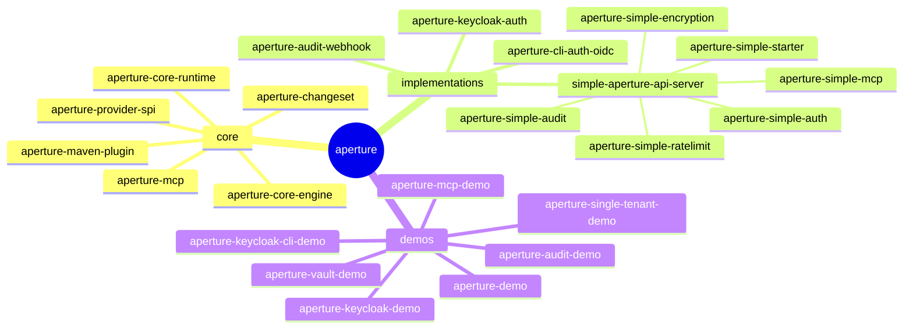

# Aperture

> **Focus on the model. Aperture handles the exposure.**

Aperture generates a fully operational multi-tenant JSON:API server from declarative YAML manifests. Write entity definitions, run a Maven build, and get authentication, authorization, schema migration, lifecycle hooks, audit logging, and optional MCP tool stubs — with no boilerplate code.

**Full documentation:** [aperture.itsjool.com](https://aperture.itsjool.com)

---

## How it works

You describe your domain in YAML manifests:

```yaml
apiVersion: aperture.itsjool.com/v1
kind: Entity
metadata:
  name: Invoice
spec:
  tenantScoped: true
  fields:
    amount:
      type: decimal
      required: true
    status:
      type: string
      enum: [DRAFT, ISSUED, PAID]
    customer:
      type: ref
      target: Customer
      relation: ManyToOne
      required: true
  permissions:
    Admin:      [read, delete]
    Accountant: [create, read, update]
    Viewer:     [read]
  hooks:
    ValidateInvoice:
      type: validate
      on: [create, update]
      url: http://rules-service:8080/hooks/validate-invoice
```

`mvn verify` reads your manifests and generates:

- Versioned Java entity classes and Elide controller registrations
- Role-based and attribute-based permission annotations
- Liquibase changesets for fresh installs and incremental upgrades
- MCP tool stubs (when enabled)
- Lock file snapshots for breaking-change detection

The runtime wires JWT + API-key auth, multi-tenancy, rate limiting, audit logging, and hook dispatch. Nothing to configure by hand.

---

## Features

| Feature | Description |
|---|---|
| **JSON:API** | Full CRUD, RSQL filtering, sorting, pagination, sparse fieldsets, compound documents, atomic operations |
| **Multi-tenancy** | POOL (shared schema) and NONE (single-tenant) modes |
| **Auth** | JWT, personal API keys, service accounts, invite flow, refresh token rotation |
| **Authorization** | Role-based permissions and attribute-based policies declared in the manifest |
| **Lifecycle hooks** | Guard (pre-auth), validate (pre-commit), mutate (pre-commit, can modify), trigger (async post-commit) |
| **Schema migration** | Liquibase changesets generated and managed automatically |
| **Audit** | Every write captured with principal, tenant, before/after state |
| **MCP** | Optional Model Context Protocol tool generation from entity manifests |
| **Encryption** | Transparent field-level encryption with a swappable KMS SPI |

---

## Repository layout



Dependencies flow `demos → implementations → core`. Core has no dependency on any implementation or demo.

---

## Getting started

Install the toolchain with [mise](https://mise.jdx.dev/):

```bash
mise trust
mise install
```

Build and test:

```bash
mvn clean package -DskipTests   # compile and package
mvn test                         # unit tests
mvn verify                       # unit + component tests (requires Docker)
```

Project workflows are also exposed as `mise` tasks. From the repository root,
run `mise run` for the interactive task picker, or run a task directly:

```bash
mise run docs:test
mise run demos:aperture-demo:docker-deploy
```

Run the reference demo:

```bash
cd demos/aperture-demo
mise run docker-deploy
# Browse to http://localhost:3780 after ~60 seconds
```

Run the focused audit export demo:

```bash
mvn -pl demos/aperture-audit-demo -am package -DskipTests
cd demos/aperture-audit-demo
docker compose up -d
./audit-smoke-test.sh
```

See the [quick-start guide](https://aperture.itsjool.com/guide/quick-start) for a step-by-step walkthrough.

---

## Documentation

| Section | URL |
|---|---|
| Guide | [aperture.itsjool.com/guide/](https://aperture.itsjool.com/guide/) |
| Manifest schema reference | [aperture.itsjool.com/reference/manifest-schema](https://aperture.itsjool.com/reference/manifest-schema) |
| REST API reference | [aperture.itsjool.com/reference/rest-api](https://aperture.itsjool.com/reference/rest-api) |
| Examples | [aperture.itsjool.com/examples/](https://aperture.itsjool.com/examples/) |
