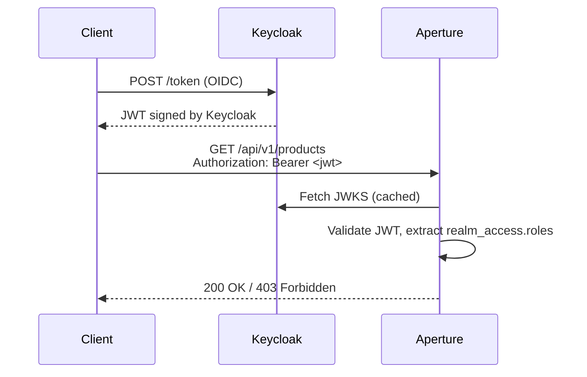

# Aperture Demos

Seven runnable demos showing different deployment configurations of the Aperture framework. Each is a self-contained Spring Boot application with Docker Compose for local development and a Testcontainers component test suite.

Each demo has local `mise` tasks for common workflows. From a demo directory, run `mise run` for
the interactive picker, or run tasks such as `mise run docker-deploy`, `mise run docker-clear`,
`mise run build-api`, and `mise run test`. From the repository root, the same tasks are available
with catalog names such as `mise run demos:aperture-demo:docker-deploy`.

---

## aperture-demo — Multi-tenant (POOL mode)

The reference demo. Multiple tenants share one database schema, separated by an `aperture_tenant_id` column on every domain table. The framework manages tenant lifecycle (create/suspend/delete) and enforces row-level isolation automatically.

**Domain**: Customer, Invoice, LineItem, Payment, Product, Supplier, Currency, Country  
**Auth**: Aperture's built-in JWT auth (`/auth/login`)  
**Highlights**: POOL tenancy, optimistic locking, soft delete, field encryption, hooks (validate/mutate/trigger/guard), rate limiting, audit log, MCP server, atomic operations, distributed tracing

The rate-limit component test now runs against a Valkey-backed provider with a deterministic low-capacity request path so it proves the configured `429` response and the `X-RateLimit-*` headers without changing the demo’s default runtime limits.

```bash
cd demos/aperture-demo
mise run docker-deploy
# Browse http://localhost:3780 after ~60s
```

Bruno collection: `api-collection/` covers auth, tenant management, users, invites,
service accounts, entity CRUD, atomic operations, MCP, optimistic locking, GraphQL, and
`scopedBy` filtering, plus a cleanup folder — with a `10-cli/` README mapping each folder
to the equivalent generated-CLI command (`mise run test-cli` runs the automated version).

---

## aperture-single-tenant-demo — Single-tenant (NONE mode)

Proves the `tenancyMode: none` code path end-to-end. Domain tables have no tenant column; the `/manage/tenants` REST API is disabled (returns 404).

**Domain**: Note entity (title, content) with Admin and ReadOnly roles  
**Auth**: Aperture's built-in JWT auth  
**Highlights**: NONE tenancy, optimistic locking (ETag / If-Match), soft delete, role-based permission enforcement

```bash
cd demos/aperture-single-tenant-demo
mise run docker-deploy
```

Bruno collection: `api-collection/` covers auth and Note CRUD for both the
Admin and ReadOnly roles, plus a cleanup folder.

**Component test coverage:**
- Bootstrap admin can log in
- Admin-role user can create notes (201)
- ReadOnly user is rejected on create (403)
- `/manage/tenants` returns 404 in NONE mode
- `aperture_tenant_id` column absent from schema
- Stale ETag on PATCH returns 412

---

## aperture-mcp-demo — Model Context Protocol (MCP) tools

Proves that MCP tools can be generated from manifests and served through the same authentication, authorization, and JSON:API request path as the normal API. Demonstrates full CRUD operations on related entities over MCP.

**Domain**: Project and Task entities (Task has a required ManyToOne relationship to Project)  
**Auth**: Aperture's built-in JWT auth  
**Highlights**: Generated MCP tools, relationship-aware write payloads, JSON:API integration, four MCP client templates (Claude Code, Codex, Gemini CLI, Antigravity CLI)

```bash
cd demos/aperture-mcp-demo
docker compose up -d --build
# Create an API key and configure your MCP client
# See the README for client setup steps (Claude Code, Codex, Gemini, Antigravity)
```

Bruno collection: `api-collection/` covers auth, JSON:API CRUD, MCP initialization, tool listing, and tool invocation for both Project and Task entities.

---

## aperture-audit-demo — Audit export to SIEM-style sink

Proves that the `AuditWriter` SPI can fan out audit events to an external HTTP destination while keeping the built-in JDBC audit endpoint available.

**Domain**: Product entity with an encrypted supplier field  
**Auth**: Aperture's built-in JWT auth  
**Highlights**: `AuditWriter` SPI, JDBC + webhook composite writer, WireMock SIEM sink, before/after UPDATE details

```bash
mvn -pl demos/aperture-audit-demo -am package -DskipTests
cd demos/aperture-audit-demo
docker compose up -d
./audit-smoke-test.sh
```

---

## aperture-keycloak-demo — External identity provider (SPI)

Proves the `CredentialValidator` / `PrincipalMapper` SPI. Aperture's built-in JWT infrastructure is completely absent — no `/auth` endpoint, no JWT secret required. All identity is managed by Keycloak 26.

**Domain**: Product and Order entities with Admin and User roles  
**Auth**: Keycloak JWT (validated via JWKS endpoint — stateless, no session in Aperture)  
**Highlights**: `CredentialValidator` SPI, `PrincipalMapper` SPI, NONE tenancy, Keycloak realm roles mapped to Aperture permissions

### How auth works



In production, the client obtains its JWT from Keycloak using the OIDC authorization code flow or device flow — Aperture never sees a password. The ROPC grant used in tests is a testing convenience only.

### Opting out of simple auth

Set the following in `application.yml` to disable Aperture's built-in JWT infrastructure:

```yaml
aperture:
  auth:
    simple:
      enabled: false
```

This suppresses `SimpleAuthConfiguration` (no JWT beans, no `AuthController`) and allows a custom `CredentialValidator` bean to be picked up by the auth filter instead.

### Running the demo

```bash
cd demos/aperture-keycloak-demo
mise run docker-deploy
# Keycloak admin UI: http://localhost:8180  admin/admin
# Aperture API:      http://localhost:8080
```

Bruno collection: `api-collection/` covers the Keycloak ROPC token exchange
(the same testing-convenience grant the component tests use) plus Product/Order
CRUD as Admin and User, and a cleanup folder.

---

## aperture-keycloak-cli-demo — OIDC device-code CLI

Proves the generated CLI auth override SPI against Keycloak's OIDC device authorization grant. The API uses the shared `aperture-keycloak-auth` server-side JWT validation module; the generated CLI uses `aperture-cli-auth-oidc` to acquire and refresh bearer tokens.

**Domain**: Product and Order entities with Admin and User roles  
**Auth**: Keycloak JWT for the API; OIDC device-code login for the generated CLI  
**Highlights**: full `CliAuthExtension` source override, OIDC discovery, device-code polling, token refresh, Keycloak public CLI client

```bash
cd demos/aperture-keycloak-cli-demo
mise run build-api
mise run docker-deploy
# Keycloak admin UI: http://localhost:8181  admin/admin
# Aperture API:      http://localhost:8081
```

Then follow the device login walkthrough in `demos/aperture-keycloak-cli-demo/README.md`,
or run `./device-flow-smoke.sh` from that directory to drive the same flow headlessly
(curl standing in for the browser). Bruno collection: `api-collection/` covers
password-grant requests against the server-audience `aperture-api` client for
Product/Order CRUD, plus a cleanup folder.

---

## aperture-vault-demo — Enterprise KMS encryption (SPI)

Proves that Aperture's field encryption can be backed by an enterprise KMS without changing any generated domain code. The `EncryptionService` SPI is replaced with a HashiCorp Vault Transit implementation — a single Spring bean swap.

**Domain**: Patient entity with an encrypted `medical_history_notes` field  
**Auth**: Aperture's built-in JWT auth  
**Highlights**: `EncryptionService` SPI, Vault Transit, tenant-bound encryption context, Testcontainers Vault

```bash
cd demos/aperture-vault-demo
mise run docker-deploy
```

API clients send and receive plaintext. Postgres stores Vault ciphertext (`vault:v1:...`). The encryption context binds ciphertext to the tenant — data encrypted under one tenant cannot be decrypted under another.

Bruno collection: `api-collection/` walks Login → Create Patient → Get Patient →
Verify Ciphertext (see `aperture-vault-demo/README.md` for the full walkthrough).

---

## Shared patterns

All demos share:
- PostgreSQL via Testcontainers for component tests
- `aperture-maven-plugin:generate` driving code generation from YAML manifests
- Liquibase schema migration from generated lock files
- `@SpringBootTest` component tests exercising the real API boundary
- A Bruno collection (`api-collection/`) of ready-to-run HTTP requests mirroring
  the demo's walkthrough — see each demo's section above for what it covers
