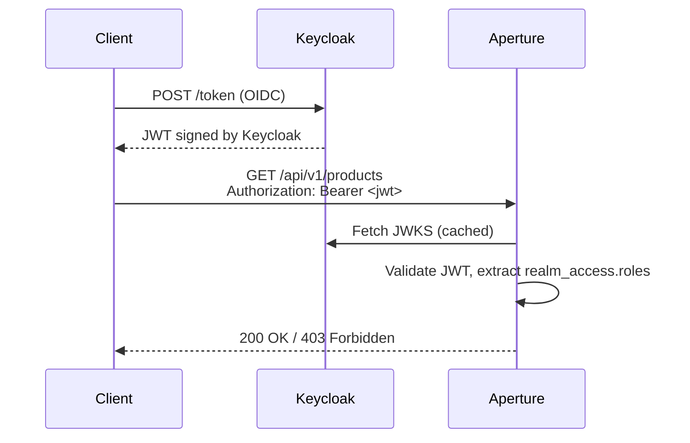

# Aperture Demos

Four runnable demos showing different deployment configurations of the Aperture framework. Each is a self-contained Spring Boot application with Docker Compose for local development and a Testcontainers component test suite.

---

## aperture-demo — Multi-tenant (POOL mode)

The reference demo. Multiple tenants share one database schema, separated by an `aperture_tenant_id` column on every domain table. The framework manages tenant lifecycle (create/suspend/delete) and enforces row-level isolation automatically.

**Domain**: Customer, Invoice, LineItem, Payment, Product, Supplier, Currency, Country  
**Auth**: Aperture's built-in JWT auth (`/auth/login`)  
**Highlights**: POOL tenancy, optimistic locking, soft delete, field encryption, hooks (validate/mutate/trigger/guard), rate limiting, audit log, MCP server, atomic operations, distributed tracing

```bash
cd demos/aperture-demo
docker compose up -d
# Browse http://localhost:3000 after ~60s
```

---

## aperture-single-tenant-demo — Single-tenant (NONE mode)

Proves the `tenancyMode: none` code path end-to-end. Domain tables have no tenant column; the `/manage/tenants` REST API is disabled (returns 404).

**Domain**: Note entity (title, content) with Admin and ReadOnly roles  
**Auth**: Aperture's built-in JWT auth  
**Highlights**: NONE tenancy, optimistic locking (ETag / If-Match), soft delete, role-based permission enforcement

```bash
cd demos/aperture-single-tenant-demo
docker compose up -d
```

**Component test coverage:**
- Bootstrap admin can log in
- Admin-role user can create notes (201)
- ReadOnly user is rejected on create (403)
- `/manage/tenants` returns 404 in NONE mode
- `aperture_tenant_id` column absent from schema
- Stale ETag on PATCH returns 412

---

## aperture-keycloak-demo — External identity provider (SPI)

Proves the `CredentialValidator` / `PrincipalMapper` SPI. Aperture's built-in JWT infrastructure is completely absent — no `/auth` endpoint, no JWT secret required. All identity is managed by Keycloak 26.

**Domain**: Product and Order entities with Admin and User roles  
**Auth**: Keycloak JWT (validated via JWKS endpoint — stateless, no session in Aperture)  
**Highlights**: `CredentialValidator` SPI, `PrincipalMapper` SPI, NONE tenancy, Keycloak realm roles mapped to Aperture permissions

### How auth works



In production, the client obtains its JWT from Keycloak using the OIDC authorization code flow or device flow — Aperture never sees a password. The ROPC grant used in tests is a testing convenience only.

### Opting out of simple auth

Set the following in `application.yml` to disable Aperture's built-in JWT infrastructure:

```yaml
aperture:
  auth:
    simple:
      enabled: false
```

This suppresses `SimpleAuthConfiguration` (no JWT beans, no `AuthController`) and allows a custom `CredentialValidator` bean to be picked up by the auth filter instead.

### Running the demo

```bash
cd demos/aperture-keycloak-demo
docker compose up -d
# Keycloak admin UI: http://localhost:8180  admin/admin
# Aperture API:      http://localhost:8080
```

---

## aperture-vault-demo — Enterprise KMS encryption (SPI)

Proves that Aperture's field encryption can be backed by an enterprise KMS without changing any generated domain code. The `EncryptionService` SPI is replaced with a HashiCorp Vault Transit implementation — a single Spring bean swap.

**Domain**: Patient entity with an encrypted `medical_history_notes` field  
**Auth**: Aperture's built-in JWT auth  
**Highlights**: `EncryptionService` SPI, Vault Transit, tenant-bound encryption context, Testcontainers Vault

```bash
cd demos/aperture-vault-demo
docker compose up --build --force-recreate --renew-anon-volumes
```

API clients send and receive plaintext. Postgres stores Vault ciphertext (`vault:v1:...`). The encryption context binds ciphertext to the tenant — data encrypted under one tenant cannot be decrypted under another.

---

## Shared patterns

All demos share:
- PostgreSQL via Testcontainers for component tests
- `aperture-maven-plugin:generate` driving code generation from YAML manifests
- Liquibase schema migration from generated lock files
- `@SpringBootTest` component tests exercising the real API boundary
